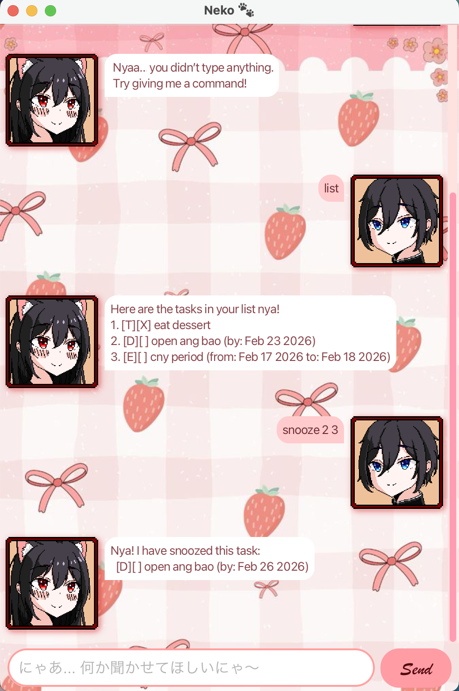

# Neko User Guide 🐾



Neko is your little digital companion that keeps track of your tasks so nothing slips through your paws. Simple, fast, and always reliable.

---
# Features

## Adding a todo : `todo DESCRIPTION`

Adds a todo task without any date.

Example: `todo read book`

Adds a new todo task to the list.
```
Hehe~ I've added this for you:
[T][ ] read book
Now you have 1 tasks in the list, nya.
```

## Adding a deadline : `deadline DESCRIPTION /by YYYY-MM-DD`

Adds a task with a deadline.

Example: `deadline submit assignment /by 2026-02-20`

Adds a deadline task with the specified due date.
```
Hehe~ I've added this for you:
[D][ ] submit assignment (by: 2026-02-20)
Now you have 2 tasks in the list, nya.
```

## Adding an event : `event DESCRIPTION /from YYYY-MM-DD /to YYYY-MM-DD`

Adds a task that occurs over a time period.

Example: `event project meeting /from 2026-02-18 /to 2026-02-19`

Adds an event task with the specified start and end dates.
```
Hehe~ I've added this for you:
[E][ ] project meeting (from: 2026-02-18 to: 2026-02-19)
Now you have 3 tasks in the list, nya.
```

## Listing all tasks : `list`

Displays all tasks currently stored.

Example: `list`

Shows all tasks in the list with their index numbers.
```
Here are the tasks in your list nya!
1. [T][ ] read book
2. [D][ ] submit assignment (by: Feb 20 2026)
3. [E][ ] project meeting (from: Feb 18 2026 to: Feb 19 2026)
```

## Marking a task: `mark INDEX`

Marks the specified task as completed.

Example: `mark 1`

Marks task 1 as done.
```
Good job! I marked this as done, nya~
[T][X] read book
```

## Unmarking a task: `unmark INDEX`

Marks the specified task as not completed.

Example: `unmark 1`

Marks task 1 as not done.
```
Hmm~ not done yet? I unmarked it for you.
[T][ ] read book
```

## Deleting a task: `delete INDEX`

Deletes the specified task from the list.

Example: `delete 2`

Removes task 2 from the list.
```
Roger nya! I have deleted this task:
[D][ ] submit assignment (by: Feb 20 2026)
Now you have 2 tasks in the list.
```

## Finding tasks: `find KEYWORD`

Finds tasks containing the specified keyword.

Example: `find assignment`

Displays all tasks whose descriptions contain the keyword.
```
I found them nya! Here are the matching tasks in your list.
2. [E][ ] project meeting (from: Feb 18 2026 to: Feb 19 2026)
```

## Snoozing a deadline or event: `snooze INDEX DAYS`

Postpones a deadline or event task by a number of days.

Example: `snooze 2 3`

Updates the deadline of task 2 by 3 days.
```
Nya! I have snoozed this task:
[E][ ] project meeting (from: Feb 18 2026 to: Feb 22 2026)
```

## Exiting the program `bye`

Exits the application.

Example: `bye`

Closes the application safely.
```
Aww… leaving already? I’ll be here when you’re back, nya~
⠀⠀⠀⠀⢀⡴⣄⠀⠀⠀⠀⢠⣄⠀⠀⠀⠀⠀⠀⠀⣼⣿⡟⠃
⠀⠀⠀⣰⠋⠀⠈⠓⠒⠒⠒⠚⠈⢳⡄⠀⠀⠀⠀⠀⣿⣿
⠀⠀⣼⠃⠀⠀⠀⠀⠀⠀⠀⠀⠀⠀⢻⣤⣤⣤⣤⣤⣿⣿⣄
⠀⠀⡇⠀⠀⠀⠀⠀⠀⠀⠀⠀⠀⠀⠀⣷⠀⠀⠀⠀⠀⠀⠙⣷⡴⠶⣦
⠀⠀⢷⡀⠀⠉⠉⠀⠀⠀⠉⠉⠀⠀⣠⡿⠀⠀⠀⢀⣀⣠⣤⠿⠞⠛⠋
⣠⠾⠋⠙⣶⠤⠤⠤⠤⣤⡤⠤⠤⠞⣠⡴⠶⠚⠋⠉⠁
⠛⠒⠛⠉⠉⠀⠀⠀⣴⠟⢃⡴⠛⠋⠉
⠀⠀⠀⠀⠀⠀⠀⠀⠛⠛⠋
```

---

# Command summary
| Action | Format |
|--------|--------|
| Add Todo | `todo DESCRIPTION` |
| Add Deadline | `deadline DESCRIPTION /by YYYY-MM-DD` |
| Add Event | `event DESCRIPTION /from YYYY-MM-DD /to YYYY-MM-DD` |
| List | `list` |
| Mark | `mark INDEX` |
| Unmark | `unmark INDEX` |
| Delete | `delete INDEX` |
| Find | `find KEYWORD` |
| Snooze | `snooze INDEX DAYS` |
| Exit | `bye` |
